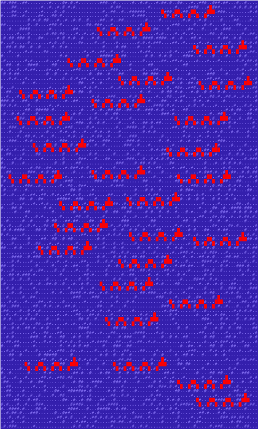

Advent of Code 2020
====================

My year 2020 solutions for [ Advent of Code ](https://adventofcode.com/2020). 

This year I will try Python as language,
first because it is simple and has a lot of "batteries included" for number-crunching tasks, 2nd because my
Python skills are somewhat rusty.

## Diary

### Day Zero - Setup

Today I just set up my env, did a proof-of-concept implementation ([ Puzzle #1 from last year ](https://adventofcode.com/2019/day/1)),
and organized my files.

First outcome: a lib with:

* `fn measure(Function)`: executes the given function and returns its time needed to run
* `fn readfile(file, sep)`: reads a file, returns a list with its lines, or a split version of a line.


### Day 01 - Report Repair

As always, that one was easy - double loop through some list and find some that match a criteria -
nice for setting all things up and to get warm.

Just used a O(n^2) / O(n^3) loop structure, which didn't need optimization, as the list was short enough:

Solution 1 took 2.5ms, Solution 2 took 87ms with python 3 on my MacBook Pro 2014.

### Day 02 - Password Philosophy

A simple string count / regex excercise. One nice thing I learned with python today:

- it's super-simple to count nr of chars / substrings in a string: `str.count(substr)`
- working with grouped regex also is extremely simple:
```python
import re
# find format: '(nr)-(nr) (char): (*)'
# matches something like: 1-3 a: abcde
m = re.compile("(\d+)-(\d+)\s+(.):\s+(.*)")
g = m.match(str)
if g:
    group1 = g.group(1)
```

So python makes things really simple


### Day 03 - Toboggan Trajectory

A modulo exercise - move within a wrapping plane (a cylinder, if you want), and count
occurences of values. Trivial finger-excercise :-)


### Day 04 - Passport Processing

This day was all about string parsing / matching:

* Split entries by newline separator (as in http header/body, e.g.)
* split single entry into key/value
* match entries against a set of rules

... and some book-keeping of all the matched rules. This excercise was simple in the end, but required a bit of typing / exact rule definition.

What I learned in python today:

* check if an array is contained in another array: `set(small_arr).issubset(set(large_arr))` --> Attention: this checks only for unique entries (e.g. in `[1,1,2,3,3,3,4]` it only checks if `1,2,3,4` is present)
* check if value is in array/set: `x in arr`
* pattern matching / regular expression matching, the simple way:
  just check if a string matches a pattern: `re.match(r"pattern", string)`

### Day 05 - Binary Boarding

Solution 1 was all about bisect - I converted the input ticket strings into int arrays (e.g. `FFBBBFFLRL` became `[1,1,0,0,0,1,1,1,0,1]` ), then to find the
row / col was just a bisect in a number range - aka binary search in the number range. So far, so simple.

For the 2nd part, we had to find one missing ticket by 1) find the set of missing
tickets from all possible tickets (that is, from the set from `0000000000` to `1111111111`). This is where things got ugly:

I created both sets as string representations, diffed the two sets to get the missing entries, then converted them back to int arrays to calc the ticket ids.

all in all it took only about 100ms, but sill... somehow there has to be a
better, more numeric solution than to diff strings...

==> **First Iteration**: I found a more elegant solution now:

I did not convert the input into int arrays, but only replaced the chars with
number strings - (e.g. `FFBBBFFLRL` became `1100011101` ). This way I didn't
have to convert it from/to int arrays.

It became much faster through this - both solutions together take only 66ms now.

==> **Second Iteration**: I now do NOT convert the strings - I just use the
original chars - this way I don't neet to convert to ints - and I do not need
to convert my full list, I can just use the `itertools.product` from python to 
generate full list.

speed gain: again - a lot: runs in 36ms now.

==> **Third Iteration**: Ah, crap! there is a MUCH SIMPLER solution for this problem: There is no need to create full ticket lists, calculate its ids etc...

Just look for a gap in the already taken ID list (sort id list, check for a distance of 2), then the missing ID is already there....

With this approach, it took 30ms in total...


I learned in python:

* diff 2 lists is super-easy: `list(set(list1) - set(list2))`
* create full combinations of a set of chars, here: (0,1) for length 10: `itertools.product([0,1], repeat = 10)`

I learned in general:

Think twice!

### Day 06 - Custom Customs

All about counting groups - so a lookup table exercise - I used python's `dict()`
and `set()` to achieve this. Form groups (keys) and count the answers either
in sum or per member.

Nothing new so far for me in python.

### Day 07 - Handy Haversacks

This day was about Graphs and graph travel, in this case, a directed graph
which forced you to do loop detection:

Bags ( aka Graph Nodes ) can contain other bags, which again can contain other
bags etc. This spans a nice directed graph.


Problem 1 + 2 both required you to travel the graph, with slighly different
tasks. So I implemented 2 `visit()` methods which
did the graph traversal with loop detection.

The problems now become more tense, as days go by ...


### Day 08 - Handheld Halting

I waited for such kind of problem - a mini-cpu-vm that runs simple
assembler-like instructions - finally it's here :-)

This one was simple, but took me some fiddling with memory copy/reset
during runs. I created a CPU class that take care of the running
and resetting of the memory for easier usage in the program itself.

I **guess** this is not the last time we have to use that or a similar vm in the
days coming...


### Day 09 - Encoding Error

That one took me too long - not because it was difficult, but because of a stupid off-by-one-error... *grrrrr*

That one was all about array slicing / searching.

In python it is really easy to create list slices:

* `a[:4]` will return a new list with the first 3 elements of the list a
* `a[2:6]` will return a new list with the elements from index 1 to 5
* `a[5:]` will return a new list with all elements starting at index 4 to the end of the old list
* `a[:]` will return a shallow copy of the list

### Day 10 - Adapter Array

This day was all about directed graphs - at least in the 2nd part.

Part one was just a simple walk-through of adapters and check their
validity / count some diffs. Simple enouth.

Part two was a bit more tricky: The trick here was to see that all
possible paths form a directed graph. Each adapter acts as a node of the graph, and walking from the start node 0 to the end device node is one path through the graph.

So one just needs to create / walk all possible paths, right? Right - only
that this approach leads to the end of the universe and back - it just runs
forever.

So I implemented a memoization pattern here: Each node traverses all coming
sub-paths recursively. Each sub-path recursion returns the numbers of 
sub-paths in front of it, and this number is stored on each node.
So each node knows how many sub-paths are possible to to forward to.

Once a node that already knows this number, we can immediately return
the recursion and do not need to walk the full graph again - now 
the whole algorithm takes only 0.000460s to find out the 
86'812'000'000'000 and what not number of paths.... wow!

Take-home advice:

again, better think twice - brute force definitively did NOT the trick here,
but a clever path traversal mechanism did.

### Day 11 - Seating System

A Double-Buffer problem: This one needed to calculate a new 2d-array state based
on a previous state - while the previous state must not be changed during
the calculation of the new one. So I implemented this using a "double-buffer"
approach:

1. copy the actual state to a 2nd buffer
2. modify the 2nd buffer based on the actual state
3. copy the 2nd buffer back to the actual state
4. repeat

Also, it was a real pain to check in all the 8 directions - so I implemented
a neat abstraction for that - maybe that may become handy in future problems.

### Day 12 - Rain Risk

That one was simple algorithm-wise (just add up coordinates), but I had especially long to figure
out all the direction turns (just a mind / head problem) for problem 2: rotating
was just a matter of swap x/y, but my head could not rotate that at 06:00AM :-)

So simple in the end, but took me too long with fiddling the correct +/-/swap structure.

Just for fun, I created a small Canvas animation of the 2nd part...
well, THAT's a trip! [12-rain-risk.html](12-rain-risk.html)

### Day 13 - Shuttle Search

First part was a simple modulo operation - The 2nd part seem to be really hard
at first sight.... then it came to me: During my math lessons in university,
we had solved a similar problem - using the Chinese Modulus Theoreom:

https://de.wikipedia.org/wiki/Chinesischer_Restsatz

So it seems like exactly that problem - our unknown x is the start time,
the modulus our buses (prime numbers), our remainders the "distance" to the
needed number modulo prime.

I implemented the chinese modulo theorem from here:

https://www.inf.hs-flensburg.de/lang/krypto/algo/chinese-remainder.htm

and it worked like a charm.

### Day 14 - Docking Data

A bit toggling / manipulating excercise - resp. a string manipulation excercise:

in python it is really simple to convert to/from int/bin/string values. In this
problem, it was much easier to apply all the manipluations on string level.

so I converted all the ints and masks to strings, manipulated them,
and converted them back.

I used the `itertools.product()` method to create all posible bit permutations
for an arbitary bit length (e.g. length = 2 ==> 00, 01, 10, 11)

Things learned in python:

* int to bin str, with padding 0: `"{:036b}".format(42)` creates a 36bit binary string
* bin to int: `int('00110100', 2)`

## Day 15 - Rambunctious Recitation

That one took me an hour, until I noticed I didn't reset a global var before
step 1 - annoying, but learned something, again: DO NOT USE GLOBAL VARS. 

Then it was simple: just book keep of numbers in a dict. But I guess there will be a much much faster solution
if it will be optimized a bit. I give it a try later on.

## Day 16 - Ticket Translation

Rule determination - the first part was not hard, just loop
through all tickets and check for errors (rule validity).

2nd part took me a while: to determine which rule belongs to
what field, I had to loop during all fields, and find the one
with exactly one (1) matching rule. Remove that from the rules-to-determine-list and start over, until all fields
have an associated rule.

This is more or less the famous Sherlock Holmes quote:

"When you've ruled out the impossible, what remains is the truth, however improbable it is." :-)

## Day 17 - Conway Cubes

An infinite-cube, state-mutation problem. My implementation
stores all (known, already calculated) coordinates in a dictionnary,
with the coordinate tuples as keys, and the state as value.

Then I create a new dict, and calculate the new state into the new dict, so to not override while calculating.

The dimensions really don't matter. The only hard part here was:

* calculating all neighbours (simple with python's itertools.product:  `neighbours = list(product([0,1,-1],repeat=dims)))` calculates all permutations of the relative coordinates 0,1,-1
* see that for all KNOWN coordinates, also the unknown neighbours
  need to be calculated, too.

Calculation is really slow (92s for solution 2), but I have some ideas how to improve,
which I am doing later.

--

After some improvements, I am down to 79s for the 2nd solution.
This is about 15% faster than my first approach, but still slow.

There is a lot of dictionnary access needed here. I guess this is
the real speed-killer here, but at the moment I don't see how to 
make this any faster.

--

Ah, finally, a solution I can live with... now 17s for solution 2.
That is a 82% increase against the first attempt. Not bad.
What did I do? Before, I just calculated all coordinates and
all of their neighbours, even if they were already calculated.
So now I just skipped the re-calculation of already known
cubes - that's it.

## Day 18 - Operation Order

I expected that one earlier - parsing, building an AST and evaluating. Luckily,
the supported expressions were very simple, and building and traversing the AST was a breeze in the end.

Nothing new so far for me in python, maybe some list operations, e.g. concat 2 lists is a breeze, too:
`[1,2,3] + [4,5,6] = [1,2,3,4,5,6]`

When do the real stuff begins, finally?? I fear the next days...

## Day 19 - Monster Messages


The first one I got stuck - Part one was solvable, I created a full list of possible strings
by traversing the expanded tree.

But for the 2nd part, things get just magnitudes too big...

I don't have a solution for now, I have to investigate furter first.

--

2nd approach: REGEXES! I just form a complete, massive regex, recursively built from the rules.
Works like a charm for part 1. For part 2, I manually replaced the recursive rule with the ... recursive version :-) so I did some recursion-resolving until a certain deepness (just tried it out manually how many are necessary, really).

Man, that one took me almost the whole day...

## Day 20 - Jurassic Jigsaw

This one is the real killer - effort-wise. In the end, it is a backtracking algorithm to find
the correct arrangement, but with some twists: checking a fit means:

- create rotations / flip versions (8 different versions)
- check "seams"

This one takes a bit more time, so I do not commit the final version here - this is a work in progress
for now.

--

Solution 1 - Wow, that almost worked out of the box. This is the algorithm I implemented roughly:

1. find a next free (not in use at the moment) tile
2. register tile as "in use", and set it in the final tile matrix
3. check if any of the tile's versions fits in to left / top edges:
    - go through all tile versions
    - check if the actual version fit to left/top
    - if yes, start recursive backtrack on NEXT (right, bottom) tile, see if there is an arrangement that matches
      - if yes, wow! that's it --> register which version was used
      - if no, check next version
    - if no match, unregister from "in use", remove from the final matrix, unregister used version, go to 1.
4. if no matching tile could be found, unregister from "in use" and tile matrix, return a fail (backtrack)

That worked like a charm. In the end, I get a tile matrix, which is **rotated** for an unknown reason,
I have to figure out why, but for solution 1 this is of no consequences, as the tile corners are the
same.

Now let's have a look what Problem 2 might be...

--

Solution 2 - That was a fun one! A bit of pattern searching in the full image, as created from the 1st
solution. I was able to capture a rare image of my sea monsters while they felt unobserved:



In the end, if solution 1 was correct, that one was not hard:

1. create a full image of the correctly rotated patterns from solution 1 (just "stitch" all the tiles
   in the correct version together)
2. search for a pixel pattern, rotate/flip the image if needed (mine was not needed to rotate)
3. mark, count, done.

## Day 21 - Allergen Assessment

This one was similar to day 16 - an elimination problem. But today it took me especially long
to figure it out - mentally blocked from yesterday, I guess.

Also, the code I produced is really ugly, with all that re-arranging, re-assigning maps/sets etc...
I don't like it. It works, but I am sure there is a more elegant, more functional approach.
Maybe I spend some time to clean it up a bit.

